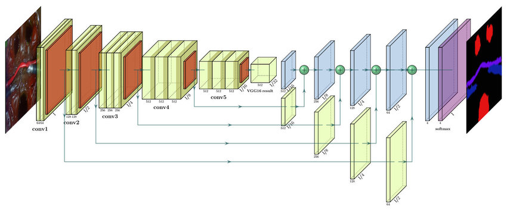

# Chapter 01 - Road Segmentation using Fully Convolutional Network (FCN)


## Overview

- The course is about **road segmentation** using **fully convolutional networks (FCN)**, which are a type of deep learning model for image segmentation.
- We use the **KITTI road data set**, which contains images of roads and their segmentation masks.
- The goal of **Road Segmentation** is to identify the drivable area of the road in an image, which is essential for Self-Driving Cars to plan their path and avoid obstacles.
  
## Requirements

- KITTI Dataset: https://www.cvlibs.net/datasets/kitti/
- Fully Convolutional Network Paper: https://arxiv.org/abs/1411.4038
- [FCN Explained - Papers With Code](https://paperswithcode.com/method/fcn)
  - Paper: https://arxiv.org/pdf/1411.4038.pdf
  - Code: https://github.com/Jackey9797/FCN
- VGGNet Paper: https://arxiv.org/pdf/1409.1556.pdf
- FCN challenger: The SegNet
  - [SegNet: A Deep Convolutional Encoder-Decoder Architecture for Image Segmentation](https://arxiv.org/pdf/1511.00561.pdf)


## The Road Segmentation Problem

- Input image (from KITTI Road Dataset):
  


- It is straightforward for humans/drivers to discern between the drivable and non-drivable areas of the road.
- Nevertheless, it is more challenging for cars to perceive the road in the same manner as humans do.
- To achieve this, the car/machine utilizes a segmentation mask image to visually interpret the road, as illustrated below:


## Solution: Computer Vision traditional Techniques vs FCN

- Traditional* CV required hardcoding of segmentation values of each image: 
  - lots of errors
  - does not generalized very good for a dynamic environment such as road vehicle with multiple scenarios

- Deep learning technique such as FCN allows to learn multiples scenarios of the road from a large volume of data (datasets) and predict/ "readapt" to new scenarions.

### FCN Architecture 


Src: FCN architecture from the original [paper](https://arxiv.org/pdf/1411.4038.pdf)

**Fully Conv Net for Road Segmentation**


**FCN-8 architecture**


- We use the **VGG-16** network as a backbone for the FCN model. VGG-16 is a pre-trained image classification network that can extract features from images.



- We modify the VGG-16 network by adding **upsampling** layers and **skip connections** to produce a segmentation mask of the same size as the input image.

Upsampling operation increases the size of a given input (length x height). 


There are four different methods of **upsampling** shown below (ranked from good to best):

- **Bed of nails**: Assign the original pixel value to one cell and zero to the rest in the upsampled block.
- **Nearest neighbor**: Assign the original pixel value to all the cells in the upsampled block.
- **Interpolation**: Assign a weighted average of the nearest pixels in the original image to the upsampled cell.
- **Transpose convolution**: Assign a learnable filter to the upsampled cell based on the original pixel value and its neighbors.


There are three variants of the FCN model:

- **FCN-32**: Upsample the last convolutional layer of VGG-16 by 32 times to get the segmentation mask.
- **FCN-16**: Upsample the last convolutional layer of VGG-16 by 2 times and add it to the second last convolutional layer, then upsample the result by 16 times to get the segmentation mask.
- **FCN-8**: Upsample the last convolutional layer of VGG-16 by 2 times and add it to the second last convolutional layer, then upsample the result by 2 times and add it to the third last convolutional layer, then upsample the final result by 8 times to get **the segmentation mask**.

## Lab: Resources & Notebooks

**Resources**

- Kaggle Dataset: 
  - https://www.kaggle.com/datasets/sakshaymahna/kittiroadsegmentation
    - Dataset description: https://www.cvlibs.net/datasets/kitti/eval_road.php
- Fully Convolutional Network Paper: https://arxiv.org/abs/1411.4038

**Paper Implementation Pipeline**

```text
1. Import Libraries
2. Load Dataset
    - Preprocessing: load image-seg mask pairs
    - train test validation split
3. Apply Transformations
    - normalization
    - load img train
    - load img test
    - display samples
4. Define Network (Build)
    - create object VGG
    - Customize to FCN
5. Train
    - Loss function
    - Check model
        - create a mask of the network prediction
        - show prediction
6. Test & Evaluation
    - weighted img: compute mask over img
    - process img mask: mask to compute single img
    - save prediction
    - save samples
7. Examples
    - Testing videos
        - play
        - process_image
```

**Notebooks**

|Lab (local)|Colab|Kaggle|
|--|--|--|
|[Lab repo](./lab/notebooks/01-Road-Seg/road-segmentation-fcn-tf.ipynb)| [](https://colab.research.google.com/github/afondiel/Self-Driving-Cars-Perception-and-Deep-Learning-Free-Course-freeCodeCamp/blob/main/lab/notebooks/01-Road-Seg/road-segmentation-fcn-tf.ipynb)|[](https://www.kaggle.com/code/thepostitguy/road-segmentation-fcn-tf/edit)|

**Additional Resources**

- Hand Crafted Road Segmentation (Demo):
  - [Udacity Self Driving Cars Advanced Lane Detection](https://www.youtube.com/watch?v=X00uXRSB0go)

## Retrospective

We compare the results of the different upsampling methods and FCN variants on the KITTI road data set and shows that:

- **Interpolation** works better than bed of nails, nearest neighbor, and transpose convolution for upsampling.
- **FCN-8** works better than FCN-32 and FCN-16 for segmentation, as it combines the coarse and fine features from different layers of VGG-16.
- **Add** works better than concatenate for combining the skip connections, as it preserves the spatial information better.

## References

- Deep Learning and CNNs: 
  - [But what is a neural network? | Chapter 1, Deep learning - 3blue1Brown](https://www.youtube.com/watch?v=aircAruvnKk&t=0s)
- KITTI Dataset: https://www.cvlibs.net/datasets/kitti/
- [FCN Explained - Papers With Code](https://paperswithcode.com/method/fcn)
  - Paper: https://arxiv.org/pdf/1411.4038.pdf
  - Code: https://github.com/Jackey9797/FCN
- Fully Convolutional Network Paper: https://arxiv.org/abs/1411.4038
- FCN challenger: The SegNet
  - [SegNet: A Deep Convolutional Encoder-Decoder Architecture for Image Segmentation](https://arxiv.org/pdf/1511.00561.pdf)

- [Keras - Image segmentation with a U-Net-like architecture](https://keras.io/examples/vision/oxford_pets_image_segmentation/)


