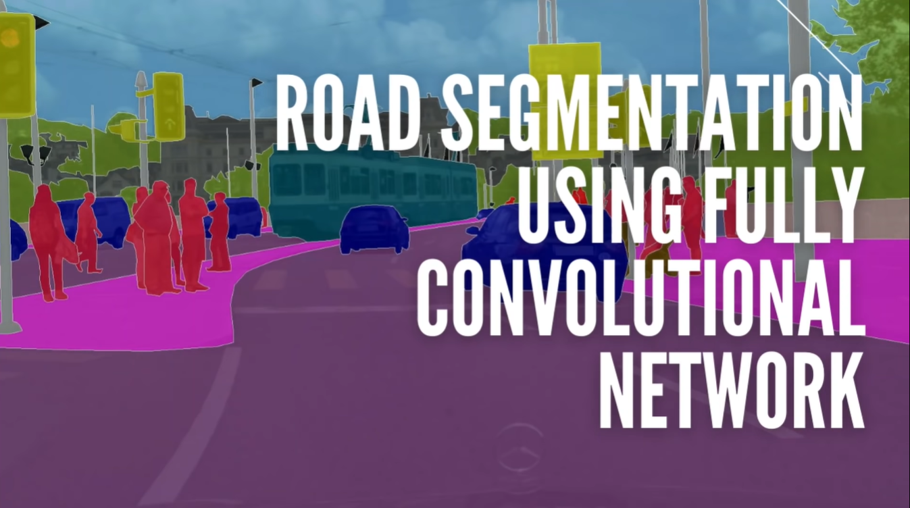
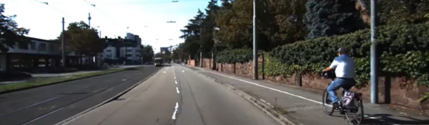
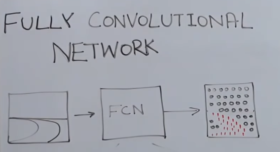
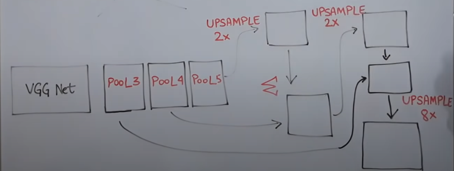
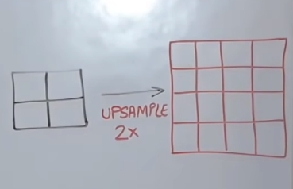

# 01 - Road Segmentation using Fully Convolutional Network (FCN)

## Overview

- The goal of **Road Segmentation** is to identify the drivable area of the road in an image, which is essential for Self-Driving Cars to plan their path and avoid obstacles.

## The Road Segmentation Problem

- Input image (from KITTI Road Dataset):
  

- Naturally, easy for humans/drivers to identify the road 
- More diffucult for cars to see the road the same way human does. 
- To see the road the car/Machine uses segmented mask image of the road, as shown below:

## Key Takeaways

- The course is about **road segmentation** using **fully convolutional networks (FCN)**, which are a type of deep learning model for image segmentation.
- We use the **KITTI road data set**, which contains images of roads and their segmentation masks.

### FCN Architecture 

*Src: FCN architecture from the original paper*

**Fully Conv Net for Road Segmentation**

- We use the **VGG-16** network as a backbone for the FCN model. VGG-16 is a pre-trained image classification network that can extract features from images.
- We modify the VGG-16 network by adding **upsampling** layers and **skip connections** to produce a segmentation mask of the same size as the input image.

*FCN-8 architecture*

There are four different methods of **upsampling**:

- **Bed of nails**: Assign the original pixel value to one cell and zero to the rest in the upsampled block.
- **Nearest neighbor**: Assign the original pixel value to all the cells in the upsampled block.
- **Interpolation**: Assign a weighted average of the nearest pixels in the original image to the upsampled cell.
- **Transpose convolution**: Assign a learnable filter to the upsampled cell based on the original pixel value and its neighbors.

There are three variants of the FCN model:
- **FCN-32**: Upsample the last convolutional layer of VGG-16 by 32 times to get the segmentation mask.
- **FCN-16**: Upsample the last convolutional layer of VGG-16 by 2 times and add it to the second last convolutional layer, then upsample the result by 16 times to get the segmentation mask.
- **FCN-8**: Upsample the last convolutional layer of VGG-16 by 2 times and add it to the second last convolutional layer, then upsample the result by 2 times and add it to the third last convolutional layer, then upsample the final result by 8 times to get **the segmentation mask**.

## Lab Resources

- Kaggle Dataset: 
  - https://www.kaggle.com/datasets/sakshaymahna/kittiroadsegmentation
- Kaggle Notebook: 
  - https://www.kaggle.com/code/sakshaymahna/fully-convolutional-network/notebook

- Hand Crafted Road Segmentation (Demo):
  - [Udacity Self Driving Cars Advanced Lane Detection](https://www.youtube.com/watch?v=X00uXRSB0go)

## Conclusion

We compare the results of the different upsampling methods and FCN variants on the KITTI road data set and shows that:

- **Interpolation** works better than bed of nails, nearest neighbor, and transpose convolution for upsampling.
- **FCN-8** works better than FCN-32 and FCN-16 for segmentation, as it combines the coarse and fine features from different layers of VGG-16.
- **Add** works better than concatenate for combining the skip connections, as it preserves the spatial information better.

## References

- Deep Learning and CNNs: 
  - [But what is a neural network? | Chapter 1, Deep learning - 3blue1Brown](https://www.youtube.com/watch?v=aircAruvnKk&t=0s)
- KITTI Dataset: https://www.cvlibs.net/datasets/kitti/
- [FCN Explained - Papers With Code](https://paperswithcode.com/method/fcn)
  - Paper: https://arxiv.org/pdf/1411.4038.pdf
  - Code: https://github.com/Jackey9797/FCN
- Fully Convolutional Network Paper: https://arxiv.org/abs/1411.4038

