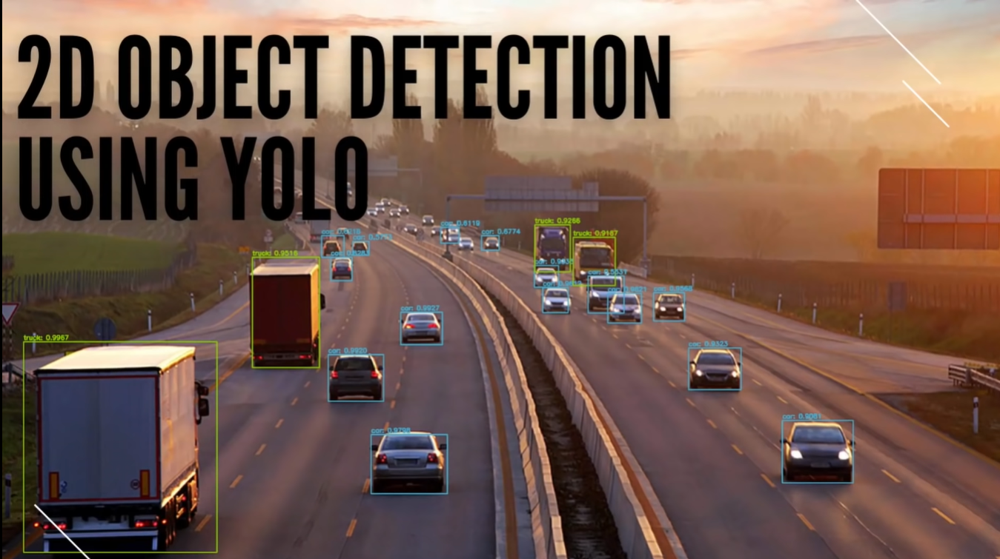

# Chapter 02 - 2D Object Detection with YOLO



## Overview

- This section is about **2D object detection** using **YOLO (You Only Look Once)**, which is a deep learning model that can detect and classify objects in images.
- The course uses the **Lyft 3D Object Detection Challenge** dataset, which contains camera and LIDAR data from a self-driving car.
- For the purpose of this course only Camera sets are used. 

## Requirements

- Kaggle Account
- YOLO v3 

## The Road Segmentation Problem
- Given a 2D image's input, we are required to estimate the location defined by a `bounding box` and the `class` of all objects in the scene. 
- Usually, we choose classes that are relevant to our application.
- For self-driving cars, we usually are most interested in object classes that are dynamic, that is ones that move through the scene.
- These include vehicles in their subclasses, pedestrians, and cyclists.
- Drawbacks:
  - Extent of obj is not fully observed
    - occlusion: background obj covered by foreground obj
    - Truncation:Obj out of img boundaries 
  - scale
    - object size gets smaller as the object moves farther ways
  - Illumination changes:
    - too bright
    - too dark  

## Solution/Methodology: Deep Learning Neural Nets


(Src: [Visual Perception - UoT - Cousera](https://github.com/afondiel/Self-Driving-Cars-Specialization/raw/main/Course3-Visual-Perception-for-Self-Driving-Cars/resources/w4/img/l1-obj-det-math1.png))

Given an input image x , we want to find the `function` (algorithm) that produces an output vector that includes the coordinates of the top-left of the box, x_min and y_min, and the coordinates of the lower right corner of the box, x_max and y_max, and a class score Sclass1 to Sclassk.

- `YOLO (You Only Look Once)` is one of the ConvNet capable of producing this kind of outcome.


## 2D Object Detection: Key Concepts

- The goal of **2D Object Detection** is to locate and classify objects in an image using bounding boxes, which are rectangular regions that enclose the objects.
- A **bounding box** is defined by four parameters: the center coordinates (x, y), the width (w), and the height (h) of the box.
- A **class label** is a categorical variable that indicates the type of the object, such as car, person, dog, etc.
- A **confidence score** is a numerical value that reflects how confident the model is about the detection, ranging from 0 to 1.
- A **threshold** is a value that determines whether a detection is valid or not, based on the confidence score. For example, if the threshold is 0.5, only detections with confidence scores above 0.5 are considered valid.
- A **non-maximum suppression (NMS)** is a technique that eliminates redundant and overlapping bounding boxes, keeping only the ones with the highest confidence scores.

## YOLO (You Only Look Once) in Action: How it Works?

- **YOLO** is a state-of-the-art, real-time object detection algorithm that uses a single convolutional neural network (CNN) to process an image in one pass.

- YOLO v3 divides the input image into a 19x19 grid (cells) and predicts a vector for each cell that contains the probability, position, size, and class of the object in that cell.
- YOLO v3 uses **anchor boxes** to handle multiple objects in the same cell. Each anchor box has a predefined shape and predicts a specific object.
- YOLO v3 uses **intersection over union (IOU)** and **non-maximum suppression (NMS)** to eliminate overlapping and redundant bounding boxes and select the best ones.
- YOLO applies a series of convolutional and pooling layers to the input image, followed by a fully connected layer that outputs a `tensor` of shape `(grid size x grid size x (bounding boxes x (4 + 1 + classes)))`.
- The output `tensor` can be interpreted as a set of predictions for each cell in the grid, where each prediction consists of 4 coordinates, 1 confidence score, and a vector of class probabilities.
- YOLO applies a softmax function to the class probabilities and a sigmoid function to the confidence scores and the coordinates.
- YOLO applies a threshold to filter out low-confidence detections and performs NMS to remove duplicate detections.
- YOLO is fast and accurate, achieving state-of-the-art performance on various benchmarks and real-world applications.
- YOLO has several versions, such as YOLOv2, YOLOv3, YOLOv4, and YOLOv5, each introducing new features and improvements to enhance the speed, accuracy, and robustness of the algorithm.
- The latest version of YOLO is YOLOv8, developed by Ultralytics, which supports a full range of vision AI tasks, such as detection, segmentation, pose estimation, and classification.


## Lab: Resources & Notebooks

**Resources**

- [Kaggle Competition/Dataset](https://www.kaggle.com/c/3d-object-detection-for-autonomous-vehicles)
- [YOLO Paper](https://arxiv.org/pdf/1506.02640.pdf)

**Paper Implementation Pipeline**

```
- TBD

```

**Notebooks**

- [Visualization Notebook - EDA](https://www.kaggle.com/code/sakshaymahna/lyft-3d-object-detection-eda) 

- [YOLO Notebook Implementation](https://www.kaggle.com/code/sakshaymahna/yolov3-keras-2d-object-detection) 


**Additional resources**

- [Playlist on Fundamentals of Object Detection](https://www.youtube.com/playlist?list=PL_IHmaMAvkVxdDOBRg2CbcJBq9SY7ZUvs) 
- [Blog on YOLO](https://www.webscale.com/engineering-education/)

## Retrospective


## References

- [Kaggle Competition/Dataset](https://www.kaggle.com/c/3d-object-detection-for-autonomous-vehicles)
- [Visualization Notebook - EDA](https://www.kaggle.com/code/sakshaymahna/lyft-3d-object-detection-eda) 
- [YOLO Notebook Implementation](https://www.kaggle.com/code/sakshaymahna/yolov3-keras-2d-object-detection) 
- [Playlist on Fundamentals of Object Detection](https://www.youtube.com/playlist?list=PL_IHmaMAvkVxdDOBRg2CbcJBq9SY7ZUvs) 
- [Blog on YOLO](https://www.webscale.com/engineering-education/)
- [YOLO Paper](https://arxiv.org/pdf/1506.02640.pdf)

Additional resources:
- [Course-3 - W4 - MODULE 4: 2D Object Detection, Course3 Visual Perception for Self-Driving Cars - U of T - Cousera](https://github.com/afondiel/Self-Driving-Cars-Specialization/blob/main/Course3-Visual-Perception-for-Self-Driving-Cars/course3-w4-notes.md)
- (1) [YOLO Object Detection Explained: A Beginner's Guide | DataCamp.](https://www.datacamp.com/blog/yolo-object-detection-explained) 
- (2) [YOLO Algorithm for Object Detection Explained [+Examples] - Medium.](https://www.v7labs.com/blog/yolo-object-detection) 
- (3) [Home - Ultralytics YOLOv8 Docs.](https://docs.ultralytics.com/) 
  
