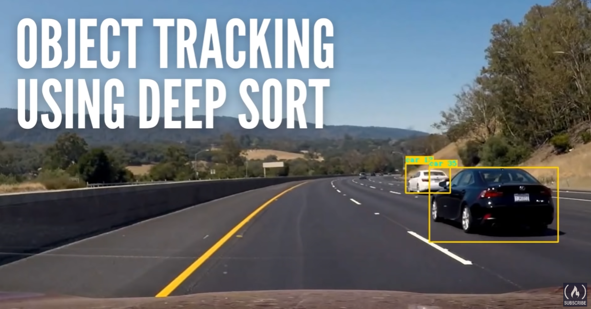
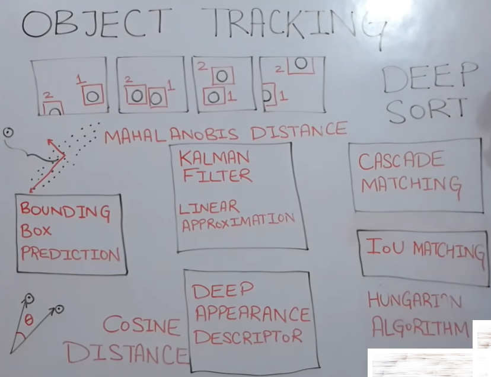

# Chapter 03 - Object Tracking using Deep SORT

## Overview

- The course is about **object tracking** using **Deep SORT**, which is a deep learning model that can track multiple objects in a video and assign them unique IDs.
- The course uses the **Lyft 3D Object Detection Challenge** data set, which contains camera and LIDAR data from a self-driving car.
- The course uses an [**open source implementation** of **YOLO v3** by **experiencor**](https://github.com/experiencor/keras-yolo3)) for object detection and **Deep SORT** for object tracking.

## Requirements

- Kaggle account
- YOLOv3
- Deep SORT
- Kalman filter (Optional)
- Opencv(Optional)

## The Object Tracking Problem

- The goal of **Object Tracking** is to track the movement and location of objects over time in a video, using their spatial and temporal features.

- Object tracking can be divided into two types: **single object tracking (SOT)** and **multiple object tracking (MOT)**.
- SOT focuses on tracking one object of interest throughout the video, while MOT tracks multiple objects of different classes simultaneously.
- Object tracking can also be divided into two methods: **tracking by detection** and **tracking without detection**.
- Tracking by detection first applies an object detector to each frame of the video, and then associates the detections across frames using a tracker.
- Tracking without detection directly estimates the object state (such as position, size, and velocity) from the raw pixel data, without using a detector.
- Tracking by detection is more popular and robust than tracking without detection, as it can handle occlusions, appearance changes, and complex backgrounds.

- However, tracking by detection also faces some challenges, such as:
    - **Data association**: how to match the detections across frames and assign unique IDs to each object.
    - **Drifting**: how to prevent the tracker from losing track of the object or switching to another object.
    - **Re-identification**: how to re-detect the object if it leaves and re-enters the scene.
  

(Src: [Course3-Visual-Perception-for-Self-Driving-Cars](https://github.com/afondiel/Self-Driving-Cars-Specialization/blob/main/Course3-Visual-Perception-for-Self-Driving-Cars/course3-w4-notes.md))

## Solutions/Methodologies: Deep Learning Algorithms

### Deep SORT (SIMPLE ONLINE AND REALTIME TRACKING) - How it Works?

**Deep SORT** is a state-of-the-art, real-time tracking by detection algorithm that extends the **Simple Online Real-Time Tracking (SORT)** algorithm.

The Deep SORT components:

(Src: [Multi-Object Tracking with DeepSORT - MathWorks](https://www.mathworks.com/help/fusion/ug/multi-object-tracking-with-deepsort.html))

- **YOLO v3**: A convolutional neural network that can detect and localize objects in an image and output their bounding boxes and classes.
- **Kalman filter**: A linear model that can predict the future motion of the objects based on their past information and update its predictions with the new observations.
- **IOU matching**: A method that uses the intersection over union (IOU) metric to measure the similarity between two bounding boxes and assign the detections to the IDs using the Hungarian algorithm.
- **Deep appearance descriptor**: A convolutional neural network that can encode the appearance of the objects in the cropped images and compare them using the cosine distance metric.
- **Cascade matching**: An extension of the IOU matching that takes into account the temporal dimension and tries to match the latest detections with the latest IDs and the older detections with the older IDs.

(Src: [DeepSORT — Deep Learning applied to Object Tracking](https://medium.com/augmented-startups/deepsort-deep-learning-applied-to-object-tracking-924f59f99104))

- SORT is a simple and fast tracker that uses a Kalman filter to predict the object state and a Hungarian algorithm to solve the data association problem.
- SORT assumes that the object maintains a constant velocity and appearance, which makes it prone to drifting and unable to handle occlusions and re-identification.
- Deep SORT improves SORT by integrating appearance information to the tracking process, using a deep neural network to extract features from the detections.
- Deep SORT uses a **Siamese network** to learn a similarity metric between the detections, based on their appearance features.
- Deep SORT uses a **cosine distance** to measure the similarity between the detections, and a **Mahalanobis distance** to measure the similarity between the predictions and the detections.
- Deep SORT combines the appearance and motion information to form a **bipartite graph** for data association, and uses a Hungarian algorithm to find the optimal matching.
- Deep SORT also maintains a **tracklet confidence** for each track, which reflects how reliable the track is, based on the number of consecutive successful and missed detections.
- Deep SORT uses a **detection confidence** threshold and a **tracklet confidence** threshold to filter out low-quality detections and tracks.
- Deep SORT performs **re-identification** by keeping a buffer of the appearance features of the lost tracks, and comparing them with the new detections.
- Deep SORT is fast and accurate, achieving state-of-the-art performance on various benchmarks and real-world applications.

## Lab: Resources & Notebooks

**Dataset & Papers**

- [KITTI-Road-Segmentation](https://www.kaggle.com/datasets/sakshaymahna/kittiroadsegmentation)
- [DeepSORT Paper](https://arxiv.org/pdf/1703.07402.pdf)

**YOLOv3 Model Implementation**

- [YOLO3 (Detection, Training, and Evaluation) - @experiencor](https://github.com/experiencor/keras-yolo3)

**DeepSORT Model Implementation**

- [YOLO3 (Detection, Training, and Evaluation) - @experiencor](https://github.com/experiencor/keras-yolo3)

**DeepSORT Notebook Implementation - course**

|Notebook|Colab|Kaggle|
|--|--|--|
|[Go to notebook](..\lab\notebooks\03-object-tracking-deep-sort.ipynb)| ||

**Additional resources**

- [Object Tracking using DeepSORT in TensorFlow 2](https://medium.com/analytics-vidhya/object-tracking-using-deepsort-in-tensorflow-2-ec013a2eeb4f)
- [Understanding Kalman Filters](https://www.youtube.com/playlist?list=PLn8PRpmsu08pzi6EMiYnR-076Mh-q3tWr) 
- [02-2D-Object-Detection-YOLOv3](https://github.com/afondiel/Self-Driving-Cars-Perception-and-Deep-Learning-Free-Course-freeCodeCamp/blob/main/02-2D-Object-Detection-YOLO.md)
- [Hungarian Algorithm for Assignment Problem | Set 1 (Introduction)](https://www.geeksforgeeks.org/hungarian-algorithm-assignment-problem-set-1-introduction/)
- [Cosine Similarity](https://www.machinelearningplus.com/nlp/cosine-similarity/)
- [Mahalanobis Distance – Understanding the math with examples (python)](https://www.machinelearningplus.com/statistics/mahalanobis-distance/)

## Retrospective

- Deep SORT can track multiple cars and assign them unique IDs, even when they are partially occluded or missed by the detector.
- Deep SORT can also track pedestrians and other objects in the scene.
- Deep SORT can fail to track the correct ID when the occlusion is too long or the objects are too similar in appearance.
- Deep SORT can be improved by tuning the hyperparameters or increasing the weight of the Kalman filter predictions.

## References

**Additional resources**
- [Understanding Multiple Object Tracking using DeepSORT - LearnOpenCV](https://learnopencv.com/understanding-multiple-object-tracking-using-deepsort/)
- [DeepSORT: Deep Learning to Track Custom Objects in a Video - Nanonets](https://nanonets.com/blog/object-tracking-deepsort/)
- [Object Tracking using DeepSORT in TensorFlow 2 - Medium](https://medium.com/analytics-vidhya/object-tracking-using-deepsort-in-tensorflow-2-ec013a2eeb4f)
- [Deep SORT: Realtime Object Tracking Guide - ikomia.ai](https://www.ikomia.ai/blog/deep-sort-object-tracking-guide)
- [What is DeepSORT and how to implement YOLOv7 for Object Tracking using DeepSORT - Medium](https://medium.com/@m.moinfaisal/what-is-object-tracking-and-why-deepsort-and-how-to-implement-yolov7-object-tracking-using-deepsort-f0c952f89b06)
- [Object Tracking with Caffe - OpenCV Team](https://github.com/afondiel/Computer-Vision-OpenCV-Python-Free-Course-Udemy/tree/main/12_Object_Tracking)

