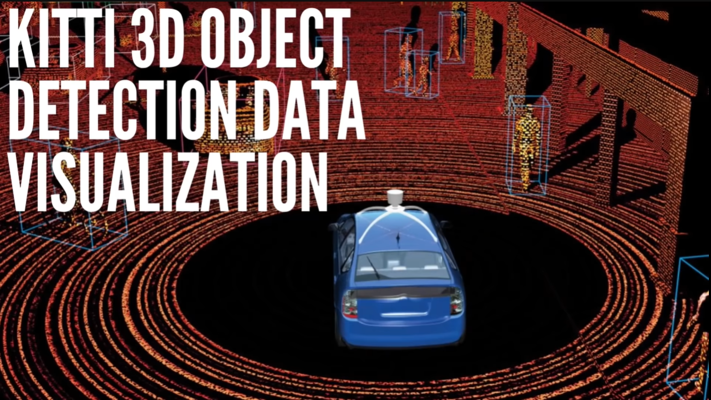

# Chapter 04 - 3D Data Visualization | Homogenous Transformations | KITTI 





## Overview

- The course is about **KITTI 3D data visualization** and **homogeneous transformations**, which are methods to convert between different coordinate systems and project 3D points onto 2D images.
- The course uses the **KITTI 3D Object Detection Challenge** dataset, which contains camera and LIDAR data from a self-driving car.

## Requirements

- Kaggle account
- KITTI Dataset

## Homogenous Transformations Concepts

Homogeneous transformations are powerful tool to visualize the LIDAR data (point cloud) in different ways:
  - **Camera view**: Projecting the LIDAR points onto the image plane of the camera using the extrinsic and intrinsic parameters of the camera. The extrinsic parameters describe the position and orientation of the camera with respect to the LIDAR, and the intrinsic parameters describe the focal length and distortion of the camera lens.
  - **Bird's eye view**: Scaling and coloring the LIDAR points to fit the image frame and show the top-down view of the scene.
  - **Bounding boxes**: Drawing 3D boxes around the objects detected by the LIDAR using the extrinsic and intrinsic parameters of the camera.

Homogeneous transformations components:


(Src: [Course2-State-Estimation-and-Localization-for-Self-Driving-Cars](https://github.com/afondiel/Self-Driving-Cars-Specialization/blob/main/Course2-State-Estimation-and-Localization-for-Self-Driving-Cars/course2-w4-notes.md))

  - **Translation**: Moving the origin of a coordinate system to a different location in space.
  - **Rotation**: Changing the direction of the axes of a coordinate system while keeping the origin fixed.
  - **Rotation matrix**: A 3x3 matrix that can rotate a 3D vector by multiplying it with the matrix.
  - **Translation vector**: A 3D vector that can translate a 3D vector by adding it to the vector.
  - **Homogeneous transformation matrix**: A 4x4 matrix that can perform both translation and rotation in a single matrix multiplication. It is constructed by putting the rotation matrix in the upper left corner, the translation vector in the upper right corner, and filling the rest with zeros and one.
  - **Homogeneous vector**: A 4D vector that can be transformed by a homogeneous transformation matrix. It is constructed by appending a one to a 3D vector.

## 3D Data Visualization: KITTI 3D Data Visualization

- The goal of **KITTI 3D Data Visualization** is to visualize the 3D data from the **KITTI dataset**, which is a benchmark for autonomous driving research that contains images, videos, and LiDAR point clouds.
- A **LiDAR** (Light Detection and Ranging) sensor is a device that emits laser pulses and measures the time and angle of the reflected signals to create a 3D representation of the environment.
- A **point cloud** is a collection of points in 3D space, each with coordinates `(x, y, z)` and optionally other attributes, such as color, intensity, or normal.
- A point cloud can be visualized using a **scatter plot**, where each point is plotted according to its coordinates and attributes.
- However, a point cloud is usually **unstructured** and **sparse**, meaning that the points are not arranged in a regular grid and there are gaps between them.
- To improve the quality and density of the point cloud, some **preprocessing** steps can be applied, such as:
    - **Filtering**: removing noise and outliers from the point cloud using statistical or geometric methods.
    - **Downsampling**: reducing the number of points in the point cloud using voxel grids, random sampling, or clustering.
    - **Registration**: aligning multiple point clouds from different viewpoints or sensors using iterative closest point (ICP) or feature-based methods.
- To project the point cloud onto a 2D image plane, such as the camera image, some **transformation** steps can be applied, such as:
    - **Translation**: shifting the point cloud by a vector (dx, dy, dz) in 3D space.
    - **Rotation**: rotating the point cloud by an angle (theta) around an axis (x, y, or z) in 3D space.
    - **Scaling**: scaling the point cloud by a factor (s) in 3D space.
    - **Perspective**: applying a perspective projection to the point cloud using a camera matrix that defines the intrinsic and extrinsic parameters of the camera.
- A **homogeneous transformation** is a mathematical tool that combines multiple transformations into a single matrix operation, using homogeneous coordinates.
- A **homogeneous coordinate** is a coordinate that has one extra dimension than the original coordinate, which is usually set to 1.
- A **homogeneous transformation matrix** is a square matrix that can perform translation, rotation, scaling, and perspective projection on a homogeneous coordinate.
- A homogeneous transformation matrix can be obtained by multiplying the individual matrices of each transformation in a specific order.
- A homogeneous transformation matrix can be applied to a point cloud by multiplying it with the point cloud matrix, which is a matrix that contains the homogeneous coordinates of each point as columns.
- A homogeneous transformation matrix can be inverted to perform the inverse transformation on a point cloud.
- A homogeneous transformation matrix can be used to transform a point cloud from one coordinate system to another, such as from the LiDAR frame to the camera frame.
- A homogeneous transformation matrix can also be used to transform a point cloud from 3D to 2D, such as from the camera frame to the image plane.
- A homogeneous transformation matrix can be visualized using a **coordinate frame**, which is a set of three orthogonal vectors (x, y, z) that represent the orientation and position of the coordinate system.


## Lab: Resources & Notebooks

**Dataset**

- [KITTI 3D Object Detection Dataset](https://www.kaggle.com/datasets/garymk/kitti-3d-object-detection-dataset)


**LIDAR Data Visualization**

|Notebook|Colab|Kaggle|
|--|--|--|
|[Go to notebook](..\lab\notebooks\04-3d-data-viz\3d-data-visualization-kitti-lidar.ipynb)| [](https://colab.research.google.com/github/afondiel/Self-Driving-Cars-Perception-and-Deep-Learning-Free-Course-freeCodeCamp/blob/main/lab/notebooks/03-object-tracking/object-tracking-deep-sort.ipynb)|[](https://www.kaggle.com/code/thepostitguy/3d-data-visualization-kitti-lidar/edit)|


**Additional resources**

- [What Is Lidar and How Does It Work?](https://www.faro.com/fr-FR/Resource-Library/Article/What-is-Lidar)
- [Why Tesla Won’t Use LIDAR](https://towardsdatascience.com/why-tesla-wont-use-lidar-57c325ae2ed5)
- [State Estimation and Localization for Self-Driving Cars - University of Toronto Self-Drivng Car Specialization](https://github.com/afondiel/Self-Driving-Cars-Specialization/blob/main/Course2-State-Estimation-and-Localization-for-Self-Driving-Cars/course2-w4-notes.md)
  - LIDAR data, operations, 3D Visualization
- [Basics of 3D Computer Vision - Perception for Self-Driving Car - University of Toronto](https://github.com/afondiel/Self-Driving-Cars-Specialization/blob/main/Course3-Visual-Perception-for-Self-Driving-Cars/course3-w1-notes.md)
  - Image Geometry, 3D - 2D transformation, 
- [3D Detection Tracking Viewer - @hailanyi](https://github.com/hailanyi/3D-Detection-Tracking-Viewer)

## Retrospective
```
- todo: solve color_map_name issue
```

## References

**Additional resources**
- (1) [KITTI 3D Data Visualization | Homogenous Transformations - YouTube](https://www.youtube.com/watch?v=tb1H42kE0eE)
- (2) [Forward Kinematics (with solved examples) - YouTube](https://www.youtube.com/watch?v=mO7JJxaVtkE)
- (3) [Using a Homogeneous Transformation Matrix to Combine Rotation and](https://www.youtube.com/watch?v=LftL6dA6tzE)


