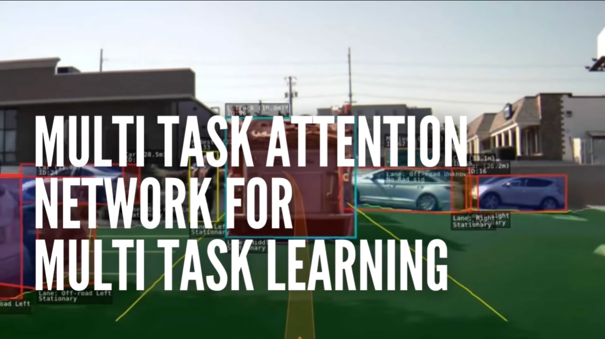
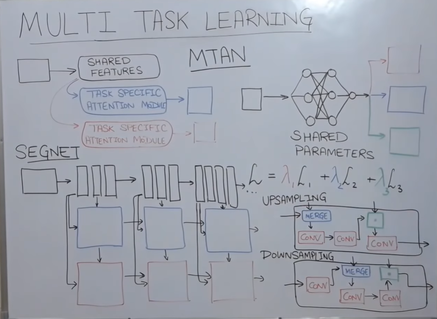

# Chapter 05 - Multi Task Learning using Multi Task Attention Network (MTAN)

## Overview

- The course is about **Multi Task Learning** using **Multi Task Attention Network (MTAN)**, which is a deep learning model that can perform multiple tasks such as depth estimation and semantic segmentation on the same input image.

- The course uses the **Cityscapes** dataset, which contains street view images from a self-driving car.

## Requirements

- Kaggle account
- Multi Task Attention Network (MTAN) 

## The Multi Task Learning Problem

- The aim is to develop a `single neural network` capable of addressing various tasks such as **object detection, classification**, and **segmentation**, rather than employing separate networks for each task. 
- This approach, known as multitask learning, offers the advantage of saving time by training the network once for all tasks. The proposed technique for achieving this is MTAN.

## Solutions/Methodologies: Deep Learning Algorithms

### Multi Task Attention Network (MTAN) - How it Works?

- MTAN components:

  - **Shared features**: A convolutional neural network that can extract common features from the input image. The course uses **SegNet** as the shared feature network, which has an encoder-decoder structure.
  - **Task-specific modules**: Sub-networks that can use the shared features and perform different tasks. The course uses two task-specific modules: one for depth estimation and one for semantic segmentation.
  - **Attention modules**: Sub-modules that can select and augment the relevant features for each task. The course uses different attention modules for the downsampling and upsampling phases of the shared feature network, and the same attention modules for the different tasks.
  - **Dynamic weighted averaging**: A technique that can adjust the weights of the losses for each task based on the rate of change of the gradient loss. The course uses softmax to compute the weights.

## Multi Task Learning (MTL)

- The goal of **Multi Task Learning (MTL)** is to train a single model to perform multiple tasks simultaneously, such as semantic segmentation, depth estimation, and surface normal estimation.
- MTL can improve the performance and generalization of the model, by exploiting the commonalities and differences among the tasks, and reducing the risk of overfitting.
- MTL can also reduce the computational cost and memory footprint of the model, by sharing parameters and features across the tasks.
- However, MTL also faces some challenges, such as:
    - **Task interference**: how to balance the trade-off between task-specific and task-shared features, and avoid negative transfer among the tasks.
    - **Loss weighting**: how to assign appropriate weights to the loss functions of each task, and avoid the domination of easier or more important tasks.
- **Multi Task Attention Network (MTAN)** is a novel MTL architecture that addresses both challenges by using a soft-attention mechanism to learn task-specific features from a shared feature pool.
- MTAN consists of two components: a **shared network** and a **task-specific network** for each task.
- The shared network can be any feed-forward neural network, such as a CNN or a ResNet, that extracts a global feature pool from the input image.
- The task-specific network consists of a series of **attention modules**, each corresponding to a layer of the shared network.
- Each attention module applies a **soft-attention mask** to the feature map of the shared network, to select the relevant features for the task.
- The soft-attention mask is learned by a small convolutional network, that takes the feature map of the shared network as input, and outputs a mask of the same size.
- The mask is normalized by a sigmoid function, and multiplied element-wise with the feature map of the shared network, to produce the task-specific feature map.
- The task-specific feature map is then processed by a convolutional layer, to generate the output of the task.
- The output of the task is compared with the ground truth, to compute the loss function of the task.
- The loss functions of all the tasks are summed up with equal weights, to form the total loss function of the model.
- The model is trained end-to-end, by minimizing the total loss function using backpropagation and gradient descent.
- MTAN can learn both task-shared and task-specific features automatically, by using the soft-attention mechanism.
- MTAN can also avoid task interference and loss weighting issues, by using a simple and uniform loss function.
- MTAN is general and flexible, as it can be built upon any feed-forward neural network, and can handle any number and type of tasks.
- MTAN is efficient and scalable, as it only adds a small number of parameters and computations to the shared network.
- MTAN is state-of-the-art and robust, as it achieves superior performance and stability on various datasets and tasks, compared to existing MTL methods.

## Lab: Resources & Notebooks

**Dataset & Papers**

- [CityScapes - Depth and Segmentation](https://www.kaggle.com/datasets/sakshaymahna/cityscapes-depth-and-segmentation)
- [CityScapes - Depth and Segmentation - EDA](https://www.kaggle.com/code/sakshaymahna/exploratory-data-analysis)
- [End-to-End Multi-Task Learning with Attention - Paper](https://arxiv.org/pdf/1803.10704.pdf)

**MTAN Model Implementation**

- [MTAN - Multi-Task Attention Network - @lorenmt](https://github.com/lorenmt/mtan)

**MTAN Notebook Implementation - course**

|Notebook|Colab|Kaggle|
|--|--|--|
|[Go to notebook](..\lab\notebooks\03-object-tracking-deep-sort.ipynb)| ||

**Additional resources**
- [An Overview of Multi-Task Learning in Deep Neural Networks](https://www.ruder.io/multi-task/)

## Retrospective

Running MTAN on the Cityscapes dataset and discusses the challenges and limitations of the model:

- MTAN can perform depth estimation and semantic segmentation on the same input image and output depth maps and segmentation masks.
- MTAN can handle occlusion, shadows, and different lighting conditions in the images.
- MTAN can face some errors in segmenting bicycles and other small objects, or estimating the depth of distant objects.
- MTAN can be improved by using the parameters suggested by the authors, such as 200 epochs and a learning rate of 10^-4.

## References

**Additional references**

- [MTAN: Multi-Task Attention Network - Shikun Liu, AI Research and Design](https://shikun.io/projects/multi-task-attention-network)
