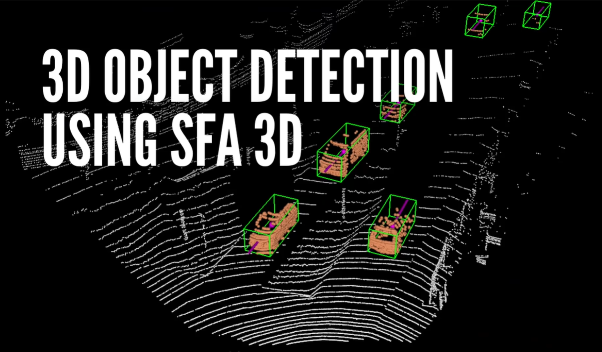
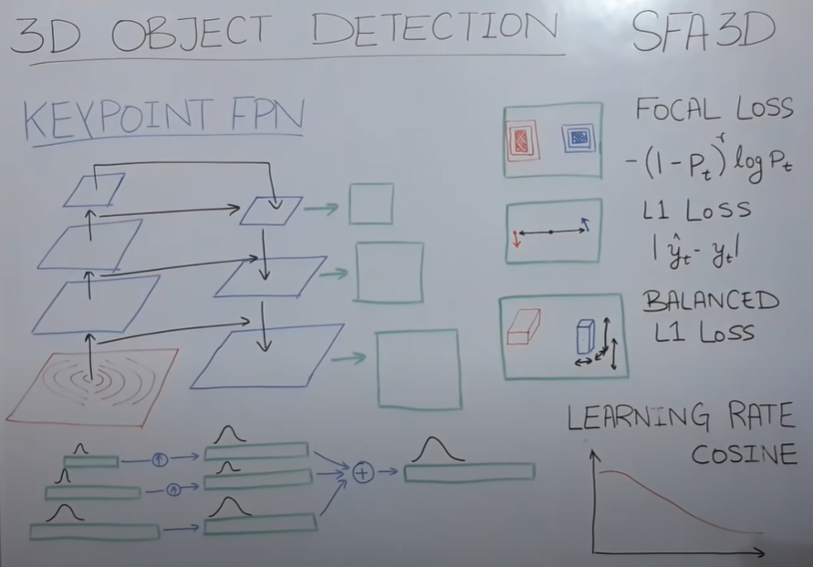

# Chapter 06 - 3D Object Detection with SFA 3D (SUPER FAST AND ACCURATE 3D OBJECT DETECTION)

## Overview

- The course is about **SFA 3D**, which is a deep learning model that can perform 3D object detection using only the LIDAR data from a self-driving car.
- The course uses the **KITTI 3D Object Detection Challenge** data set, which contains LIDAR and camera data from a self-driving car.

## Requirements

- Kaggle account
- SFA 3D
- KITTI dataset

## 3D Object Detection Problem

Recognizing 3D objects in LiDAR(Light Detection and Ranging) is a challenge
due to the complexity of point clouds (mostly unstructured data)
- This task is crucial for applications such as autonomous vehicles, robotics, and augmented reality

## Solutions/Methodologies: Deep Learning Algorithms

### SFA 3D (SUPER FAST AND ACCURATE 3D OBJECT DETECTION)  - How it Works?

SFA 3D components:
- **Bird's eye view**: A top-down view of the LIDAR data that is used as the input for the model. The bird's eye view image shows the distance and angle of the objects from the car.
- **Key Point Feature Pyramid Network (FPN)**: A feature extraction technique that can detect points in the bird's eye view image using different scales of features. The key point FPN uses a convolutional neural network with skip connections and upsampling to generate feature maps, and then applies a weighted average to get a single output feature map. The key point FPN can locate the center point of each object in the image.
- **Outputs**: The model outputs seven values for each object detected: a heat map of the class (car, cyclist, or pedestrian), the distance from the car, the direction of the object, the dimensions of the object (length, width, and height), and the z coordinate of the object (the height from the ground).
- **Loss functions**: The model uses different loss functions to train the network for each output: focal loss for the heat map, L1 loss for the distance and direction, and balanced L1 loss for the dimensions and z coordinate. The focal loss is used to deal with class imbalance, and the balanced L1 loss is used to deal with outliers and inliers in the data.
- **Learning rate scheduling**: The model uses cosine annealing to adjust the learning rate during the training process. The cosine annealing decreases the learning rate gradually and then increases it slightly at regular intervals.

## 3D Object Detection with SFA 3D

- The goal of **3D Object Detection** is to detect and localize objects in 3D space using LiDAR point clouds, which are collections of points that represent the distance and reflectance of the objects in the environment.
- 3D Object Detection is a challenging task, as it requires dealing with large-scale, sparse, and noisy data, as well as handling occlusions, rotations, and varying shapes of the objects.
- 3D Object Detection can be divided into two types: **single-stage** and **two-stage** methods.
- Single-stage methods directly predict the bounding boxes and class labels of the objects from the point clouds, without using any intermediate representation or region proposal.
- Two-stage methods first generate a set of candidate regions from the point clouds, and then refine them using a second network to produce the final detections.
- Single-stage methods are faster and simpler than two-stage methods, but they tend to have lower accuracy and recall.
- Two-stage methods are more accurate and robust than single-stage methods, but they tend to be slower and more complex.
- **SFA 3D (Super Fast and Accurate 3D Object Detection)** is a novel single-stage method that achieves state-of-the-art speed and accuracy on the KITTI dataset, which is a benchmark for autonomous driving research.
- SFA 3D consists of three components: a **backbone network**, a **feature fusion module**, and a **detection head**.
- The backbone network is a CNN that extracts features from the point clouds, using a voxelization technique that converts the point clouds into a 3D grid of voxels.
- The feature fusion module is a CNN that fuses the features from different layers of the backbone network, using a skip connection and a concatenation operation.
- The detection head is a CNN that predicts the bounding boxes and class labels of the objects, using an anchor-free approach that does not require predefined anchors or non-maximum suppression.
- SFA 3D uses a **multi-task loss function** that combines four losses: a **classification loss**, a **localization loss**, a **direction loss**, and a **distance loss**.
- The classification loss is a focal loss that measures the difference between the predicted and ground truth class probabilities of each voxel.
- The localization loss is a smooth L1 loss that measures the difference between the predicted and ground truth bounding box coordinates of each voxel.
- The direction loss is a binary cross-entropy loss that measures the difference between the predicted and ground truth direction of each voxel, which indicates whether the object is facing left or right.
- The distance loss is a smooth L1 loss that measures the difference between the predicted and ground truth distance of each voxel, which indicates how far the object is from the sensor.
- SFA 3D is fast and accurate, achieving **70.7%** average precision (AP) on the KITTI dataset, with an inference time of **0.04 seconds** per frame.
- SFA 3D is simple and efficient, using only a single network and a single stage, without any region proposal or non-maximum suppression.
- SFA 3D is general and flexible, as it can handle different types of objects, such as cars, pedestrians, and cyclists, and different levels of difficulty, such as easy, moderate, and hard.

## Lab: Resources & Notebooks

**Dataset & Papers**

- [KITTI - 3D Object Detection Dataset](https://www.kaggle.com/datasets/garymk/kitti-3d-object-detection-dataset)
- [RTM3D: Real-time Monocular 3D Detection from Object Keypoints for
Autonomous Driving - Paper](https://arxiv.org/pdf/2001.03343.pdf)

**SFA3D Model Implementation**

- [SFA3D - @maudzung](https://github.com/maudzung/SFA3D)

**3D-Object-Detection-SFA3D Notebook Implementation - course**

|Notebook|Colab|Kaggle|
|--|--|--|
|[Go to notebook](..\lab\notebooks\03-object-tracking-deep-sort.ipynb)| ||

**Additional resources**
- [Understanding Feature Pyramid Networks for object detection (FPN)](https://jonathan-hui.medium.com/understanding-feature-pyramid-networks-for-object-detection-fpn-45b227b9106c)
- [Chapter 04 - 3D Data Visualization | Homogenous Transformations | KITTI](https://github.com/afondiel/Self-Driving-Cars-Perception-and-Deep-Learning-Free-Course-freeCodeCamp/blob/main/04-3D-Data-Visualization-Homogenous-Transformations-KITTI.md)

## Retrospective

Running SFA 3D on the KITTI data set and discusses the challenges and limitations of the model:
- SFA 3D can perform 3D object detection on the LIDAR data and output bounding boxes and orientation lines for the objects in the scene.
- SFA 3D can handle different types of objects such as cars, cyclists, and pedestrians, and different distances and angles of the objects from the car.
- SFA 3D can face some errors in detecting objects that are not in the training data, such as trams, or objects that are occluded or overlapping with other objects.
- SFA 3D can be improved by using more data and better hardware for training the network.

## References

Datasets:
-[nuscenes - Motional](https://www.nuscenes.org/) 

**Additional resources**

- [Super Fast and Accurate 3D Object Detection based on 3D LiDAR Point Clouds](https://github.com/maudzung/SFA3D)
- [Heat map](https://en.wikipedia.org/wiki/Heat_map)
- [Understanding Focal Loss —A Quick Read](https://medium.com/visionwizard/understanding-focal-loss-a-quick-read-b914422913e7)
- [What Are L1 and L2 Loss Functions?](https://amitshekhar.me/blog/l1-and-l2-loss-functions)
- [Balanced L1 Loss](https://paperswithcode.com/method/balanced-l1-loss)
- [Learning Rate Decay and methods in Deep Learning](https://medium.com/analytics-vidhya/learning-rate-decay-and-methods-in-deep-learning-2cee564f910b)
- [Cosine Annealing](https://paperswithcode.com/method/cosine-annealing)
- [YOLO9000: Better, Faster, Stronger - for 3D Obj Det CVPR - 2017](https://paperswithcode.com/paper/yolo9000-better-faster-stronger)
- [The state of 3D object detection](https://towardsdatascience.com/the-state-of-3d-object-detection-f65a385f67a8)

