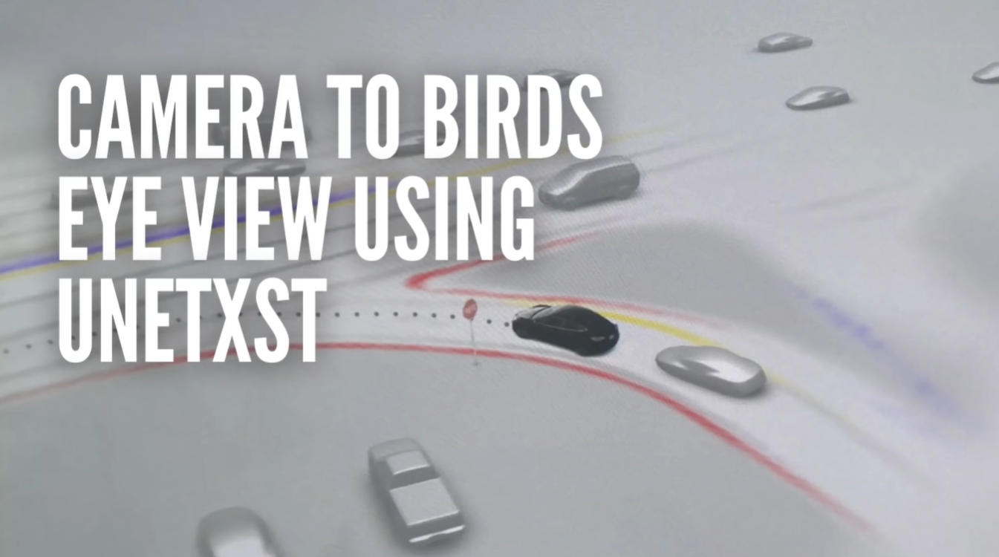
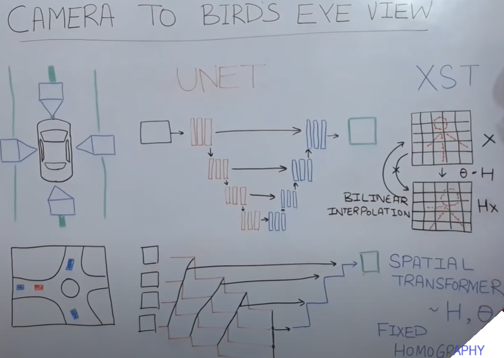

# Chapter 07 - Camera to Bird's Eye View usig UNetXST




## Overview

This is course explore the Camera to Bird's Eye View usig UNetXST ([uNet](https://en.wikipedia.org/wiki/U-Net) neural network architecture which takes multiple (X) tensors as input and contains Spatial Transformer units (ST))


## Requirements

- Kaggle account
- Semantic Segmentation - BEV
- [UNetXST](https://paperswithcode.com/method/unetxst#:~:text=Introduced%20by%20Reiher%20et%20al,contains%20Spatial%20Transformer%20units%20(ST))


## Camera to Bird's Eye View usig UNetXST Problem

- The problem is to generate a bird's eye view of the environment from four images taken by cameras on a self-driving car
- The data set is derived from a simulation with semantic segmented images and ground truth bird's eye view images captured by a drone

## Solutions/Methodologies: Deep Learning Algorithms

### UNetXST - How it Works?

- The technique is UNetXST, which combines UNet (a semantic segmentation network) and spatial transformers (modules that apply homography transformations)
- UNet has an encoder-decoder structure with skip connections that use spatial transformers to combine features from different cameras
- Spatial transformers are given fixed homography matrices that map from each camera to a virtual top camera
- Homography is a matrix multiplication that transforms pixels from one image plane to another, but it assumes a flat world and produces noisy results
- Inverse homography is used to avoid noise by mapping from output pixels to input pixels and using bilinear interpolation to calculate weighted averages
- The network is trained on Kaggle with some configuration changes to reduce the image size, increase the batch size, and decrease the number of epochs


## Camera to Bird's Eye View



- The goal of **Camera to Bird's Eye View** is to transform images taken from multiple vehicle-mounted cameras to a semantically segmented image in bird's eye view, which is a top-down view of the scene.
- Camera to Bird's Eye View is a useful task for autonomous driving, as it can provide a comprehensive and consistent representation of the environment, and facilitate tasks such as path planning, obstacle avoidance, and map building.
- Camera to Bird's Eye View can be divided into two steps: **image transformation** and **semantic segmentation**.
- Image transformation is the process of converting the images from the camera perspective to the bird's eye view perspective, using geometric and photometric transformations.
- Semantic segmentation is the process of assigning a class label to each pixel in the bird's eye view image, using a neural network that can recognize the objects and regions in the scene.
- **UNetXST** is a novel deep learning approach that combines both steps into a single network, using a combination of UNet and Spatial Transformers.
- UNet is a famous network that is used for semantic segmentation, especially in medical imaging. It has a U-shaped architecture that consists of an encoder and a decoder, with skip connections between them.
- Spatial Transformers are modules that can perform spatial transformations on the input images, such as scaling, rotation, translation, and perspective projection⁴. They consist of three components: a localization network, a grid generator, and a sampler⁴.
- UNetXST consists of four components: a **shared encoder**, a **task-specific decoder**, a **spatial transformer**, and a **fusion layer**.
- The shared encoder is a CNN that extracts features from the input images, using a series of convolutional and pooling layers.
- The task-specific decoder is a CNN that generates the output image for each task, using a series of upsampling and convolutional layers, with skip connections from the encoder.
- The spatial transformer is a module that transforms the input images to the bird's eye view perspective, using a localization network that predicts the transformation parameters, a grid generator that creates a sampling grid, and a sampler that interpolates the input pixels.
- The fusion layer is a module that fuses the output images from the task-specific decoders, using a weighted average operation that assigns different weights to each task.
- UNetXST can perform both image transformation and semantic segmentation in one pass, using a single network and a single loss function.
- UNetXST can handle multiple input images from different cameras, and produce a unified output image in bird's eye view.
- UNetXST can also handle multiple tasks, such as road segmentation, lane detection, and object detection, and produce a semantically segmented output image in bird's eye view.
- UNetXST is general and flexible, as it can be built upon any feed-forward neural network, and can handle any number and type of tasks and cameras.
- UNetXST is efficient and scalable, as it only adds a small number of parameters and computations to the UNet network.
- UNetXST is state-of-the-art and robust, as it achieves superior performance and stability on the KITTI dataset, compared to existing methods.


## Lab: Resources & Notebooks

**Dataset:**

- [Semantic Segmentation - BEV](https://www.kaggle.com/datasets/sakshaymahna/semantic-segmentation-bev)
- [BEV Data Visualization](https://www.kaggle.com/code/sakshaymahna/data-visualization)

**Paper:**
- [A Sim2Real Deep Learning Approach for the Transformation of Images from Multiple Vehicle-Mounted Cameras to a Semantically Segmented Image in Bird’s Eye View - Paper](https://arxiv.org/pdf/2005.04078.pdf)

**UNetXST Model Implementation**

- [UNetXST - @ika-rwth-aachen - Germany](https://github.com/ika-rwth-aachen/Cam2BEV)

**BEV (UNetXST) Notebook Implementation**

|Notebook|Colab|Kaggle|
|--|--|--|
|[Go to notebook](./lab/notebooks/07-UNetXST/unetxst-camera-to-bird-s-eye-view.ipynb)| [](https://colab.research.google.com/github/afondiel/Self-Driving-Cars-Perception-and-Deep-Learning-Free-Course-freeCodeCamp/blob/main/lab/notebooks/03-object-tracking/object-tracking-deep-sort.ipynb)|[](https://www.kaggle.com/code/thepostitguy/unetxst-camera-to-bird-s-eye-view/edit)|


## Overall Retrospective

- The network produces reasonable output predictions that resemble the ground truth bird's eye view images
- However, the model produces noisy output due to the assumption of a flat world and the inverse homography operation, and needs more training to improve the results

## What'ss Next?

```
- Explore different data sets, research papers, and modules for self-driving cars
- Try other computer vision projects like similarity learning, image captioning, and generative modeling
```

## References


**Additional resources**

- [Understanding Semantic Segmentation with UNET](https://towardsdatascience.com/understanding-semantic-segmentation-with-unet-6be4f42d4b47)
- [Deep Learning Paper Implementations: Spatial Transformer Networks - Part I](https://kevinzakka.github.io/2017/01/10/stn-part1/)
- [Deep Learning Paper Implementations: Spatial Transformer Networks - Part II](https://kevinzakka.github.io/2017/01/18/stn-part2/)

